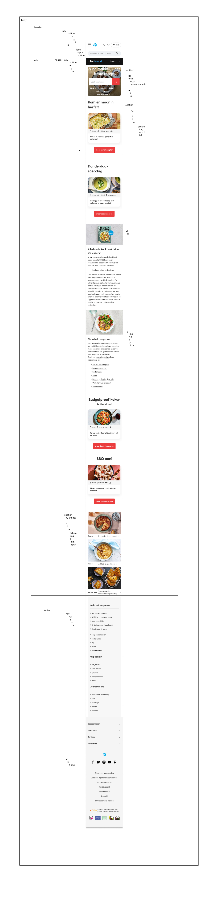
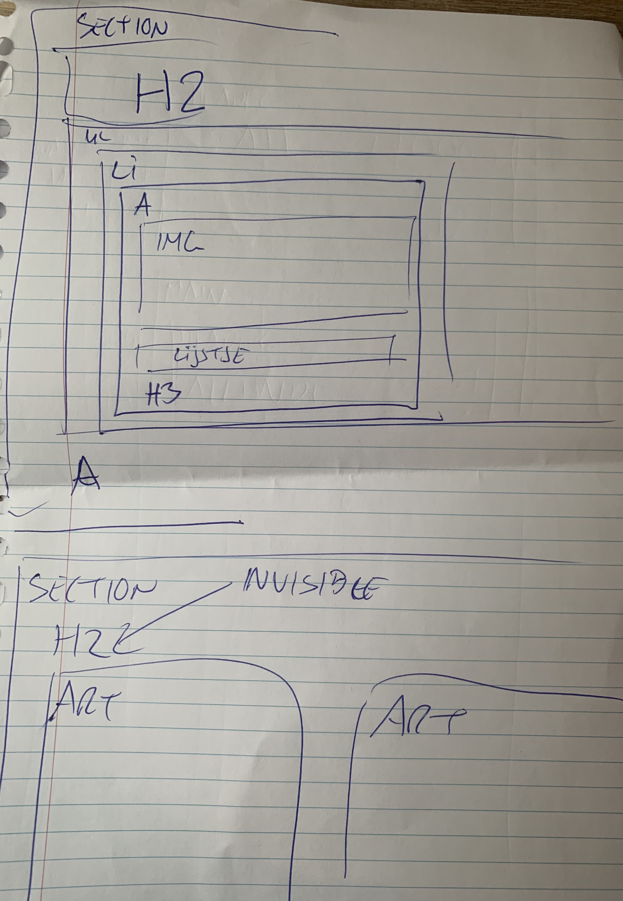
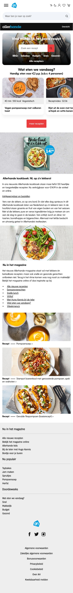
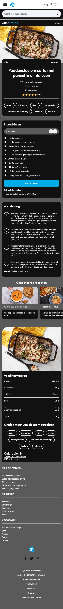
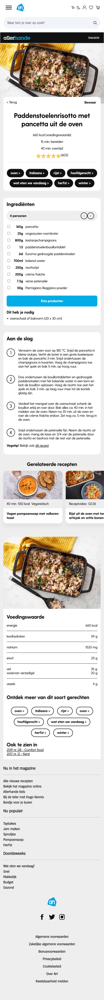
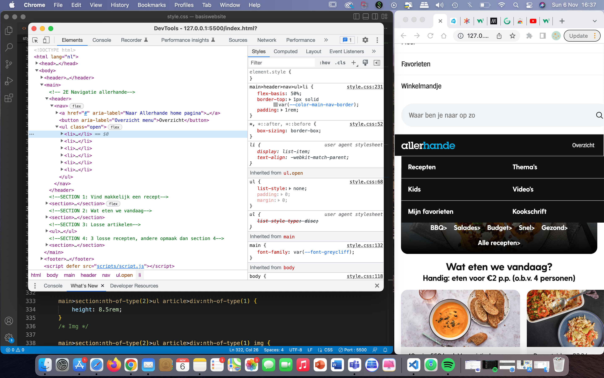
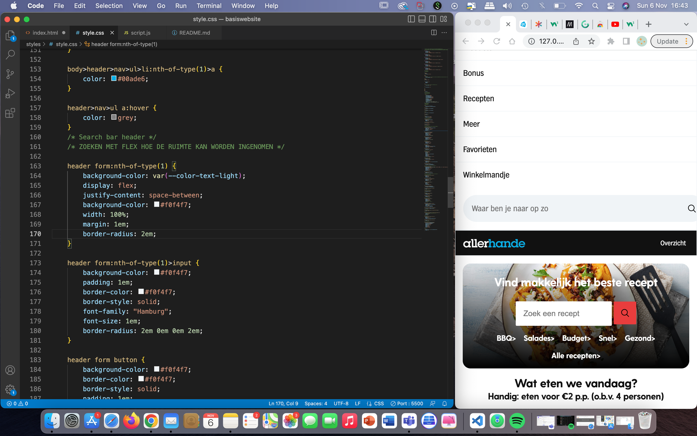
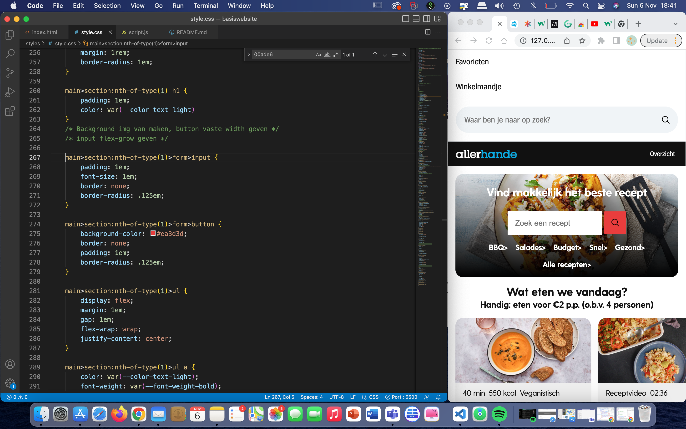

# Procesverslag
Markdown is een simpele manier om HTML te schrijven.  
Markdown cheat cheet: [Hulp bij het schrijven van Markdown](https://github.com/adam-p/markdown-here/wiki/Markdown-Cheatsheet).

Nb. De standaardstructuur en de spartaanse opmaak van de README.md zijn helemaal prima. Het gaat om de inhoud van je procesverslag. Besteedt de tijd voor pracht en praal aan je website.

Nb. Door *open* toe te voegen aan een *details* element kun je deze standaard open zetten. Fijn om dat steeds voor de relevante stuk(ken) te doen.


## Jij

<details open>
  <summary>uitwerking voor kick-off werkgroep</summary>

  ### Auteur:
  Lisa Roelvink 

  #### Je startniveau:
  Blauw

  #### Je focus:
  Surface plane
  
 
</details>


## Je website

<details open>
  <summary>uitwerking voor kick-off werkgroep</summary>

  ### Je opdracht:
  [Homepagina Allerhande](https://www.ah.nl/allerhande)

  [Detailpagina](https://www.ah.nl/allerhande/recept/R-R1189960/paddenstoelenrisotto-met-pancetta-uit-de-oven)


  #### Screenshot(s) van de eerste pagina (small screen): 
  Homepagina  
  

  #### Screenshot(s) van de tweede pagina (small screen):
  Detailpagina
  
 
</details>


## Toegankelijkheidstest 1/2 (week 1)

<details>
  <summary>uitwerken na test in 1e werkgroep</summary>

  ### Bevindingen
  Lijst met je bevindingen die in de test naar voren kwamen:

  #### Screenreader
  
  ##### Headings
  Heading level screenreader. Kom er maar in herfst section bevat geen list, waardoor er niet benoemd wordt hoeveel recepten er onder “Kom er maar in herfst” vallen. Er wordt ook niet benoemd dat het recepten zijn, maar misschien spreekt dat voor zich.

  Dubbele header verwarrend. 

  Hier een omschrijving van hoe het opgelost kan worden (met indien nodig afbeeldingen)

  Recepten/articles in een list zetten?


  #### Muis en Toetsenbord 

  ##### Scrollen
  Gebruiker navigeert terug naar Google in de carousel. 

  ##### Hover
  Buttons: zwakke hover
  Links in paragraaf: 0 hover
  Articles krijgen alleen dropshadow. Misschien kleine animatie.


  Hier een omschrijving van hoe het opgelost kan worden (met indien nodig afbeeldingen)

  Sanne heeft uitgelegd in Werkgroep 2 dat je dat kunt voorkomen.

  #### Motoriek (shocks, elastiekjes)

  De website is redelijk vergevingsgezind als het neer komt op een verkeerde klik. De gebruiker navigeerd precies terug naar het punt waar de klik is gedaan op de home pagina.

  Dit wil ik graag meenemen in mijn website.

  #### Visueel (brillen, contrast, kleurenblind, dark/light). 

  ##### Darkmode
  Niet van toepassing. Twijfel of dit echt nodig is en wat bijdraagt. 

  ##### Kleuren
  Website bevat veel en goed contrast. Afbeeldingen worden wat minder smakelijk. Teksten zijn goed te lezen.

  

  

  

  ##### Zicht
  Glaucome: cursor & hover niet te zien.
  Hemianopia: -
  Blur: cursor en hover states wel te zien, maar niet duidelijk. Tekst niet te lezen.
  Combined loss: -

  Teksten zijn met de beperkingen in zicht niet te lezen.


  Hier een omschrijving van hoe het opgelost kan worden (met indien nodig afbeeldingen)

  Wellicht grotere animaties, hovers en duidelijke kleurverandering wanneer iets wordt geselecteerd. 

</details>


## Breakdownschets (week 1)

<details>
  <summary>uitwerken na afloop 2e werkgroep</summary>

  ### de hele pagina: 
  

  ### ddetailpagina (bijv menu): 
  


</details>


## Voortgang 1 (week 2)

<details>
  <summary>uitwerken voor 1e voortgang</summary>

  ### Stand van zaken
  hier dit ging goed & dit was lastig (neem ook screenshots op van delen van je website en code)


  ### Agenda voor meeting
  samen met je groepje opstellen

  | Lisa R      | Oemar          | Ouiman    | student 4        |
  | ---            | ---                | ---          | ---              |
  | Breakdown schetsen  | Breakdownschetsen    | Ook breakdown    | en dan ik dat    |
  | 'Blokjes content' | Ul/li nakijken | nog een punt | dit wil ik zeker |
  | Hoeveelheid content bespreken            | Header nagekeken         | ...          | ...              |


  ### Verslag van meeting
  hier na afloop snel de uitkomsten van de meeting vastleggen

  - samen door de KPN website gegaan en elementen besproken
  - Hoeveelheid content besproken
  - Menu aangepast/bewerking naar groot scherm

  Notities Lisa:
  
```
<header>
    <nav>
        <ul>
            <li><a href=""></a></li>
        </ul>
        <button></button>
        <button></button>
    </nav>
</header>

<main>
	<section> 2x
	In een section MOET een H zitten.

Button: veroorzaakt een actie op de pagina.
Link: navigatie naar een andere pagina of een plek op de pagina.

H1 ‘ontbreekt’
Of op de homepage H1 aanmaken en verstoppen.
Of logo als H1 aanmaken.

3 blokken op KPN = section met daarin ul en per blok is een li.

<section>
    <ul>
        <li>
            <h3></h3>
            <ul>
                <li></li>
            </ul>
            <a href=""></a>
        </li>
        <li>
            <h3></h3>
            <ul>
                <li></li>
            </ul>
            <a href=""></a>
        </li>
        <li>
            <h3></h3>
            <ul>
                <li></li>
            </ul>
            <a href=""></a>
        </li>
    </ul>
</section>


Wanneer je een volgorde in een section met css wilt veranderen:

In de parent
Display: flex;
flex-direction: column;

In de child
order: -100;

De volgorde wordt van boven naar beneden bepaald vanaf -1, 0 en 1.

Footer:

Section Button
H3
ul
```

  Even vragen hoe ik dit in Github krijg zonder dat de code gelezen wordt.

  

  

  

</details>


## Voortgang 2 (week 3)

<details>
  <summary>uitwerken voor 2e voortgang</summary>

  ### Stand van zaken
  hier dit ging goed & dit was lastig (neem ook screenshots op van delen van je website en code)


  ### Agenda voor meeting
  samen met je groepje opstellen

  | Lisa     | Oemar          | Ouiaam    | Giuliano        |
  | ---            | ---                | ---          | ---              |
  | HTML nakijken  | HTML nakijken            | Geen specifieke agenda punten    | -----?    |
  | plan van aanpak maken | - | - | - |
  | ...            | ...                | ...          | ...              |


  ### Verslag van meeting
  hier na afloop snel de uitkomsten van de meeting vastleggen

  - Aria labels links
  - Section (articles) even in een UL zetten
  - 2e navigatie buttons maken
  - Plan van aanpak:
  - Eerst typografie
  - Daarna images positionering (kaarten en sliders)
  - Van boven naar beneden werken
  - Navigatie op het einde maken

  - Form: width: 0maken, fles grow 2 geven.


</details>


## Toegankelijkheidstest 2/2 (week 4)

<details>
  <summary>uitwerken na test in 8e werkgroep</summary>

  ### Bevindingen
  Lijst met je bevindingen die in de test naar voren kwamen (geef ook aan wat er verbeterd is):

  #### Screenreader
  Lijsten worden voorgelezen. Heb bij de afbeeldingen een aria label toegevoegd. Ook in de header.


  #### Motoriek (shocks, elastiekjes)
  Terug scrollen is vervelend. Heb daarom een overscroll-behaviour x op de html/body gezet.


  #### Visueel (brillen, contrast, kleurenblind, dark/light). 
  Dark thema werkt prima. Alleen als de headerkleur veranderd zijn de iconen niet meer te zien.

  Oplossen door header aparte :root var te geven die niet veranderd wanneer dark theme wordt geactiveerd.

</details>


## Voortgang 3 (week 4)

<details>
  <summary>uitwerken voor 3e voortgang</summary>

  ### Stand van zaken
  Krijg de knop niet in het midden. 


  ### Agenda voor meeting
  samen met je groepje opstellen

  | Giuliano     | Lisa          | Ouiaam    | student 4        |
  | ---            | ---                | ---          | ---              |
  | Custom properties  | CSS doorlopen             | CSS doorlopen dit    | en dan ik dat    |
  | en dat ook nog | dit als er tijd is | nog een punt | dit wil ik zeker |
  | ...            | ...                | ...          | ...              |


  ### Verslag van meeting
  hier na afloop snel de uitkomsten van de meeting vastleggen

  - Screenreader oefenen
  - Hover states toevoegen
  - rem, em en px aanpassen
  - clamp ()
  Plan van aanpak:
  - Eerste section stylen
  - Main
  - Footer stylen
  - Laatste: navigatie balk
  - Verschillende CSS style sheets maken per pagina
  - Begin maken 2e pagina

</details>


## Eindgesprek (week 5)

<details open>
  <summary>uitwerken voor eindgesprek</summary>

  ### Je uitkomst - karakteristiek screenshots:
  

  

  

  ### Dit ging goed/Heb ik geleerd: 

  Positionering was een ramp. Maar alles geleerd over top, translate x/y, margins overal af en bij. 

  
  


  ### Dit was lastig/Is niet gelukt:
Ik heb te veel tijd in de details gestoken. 
  

</details>


## Bronnenlijst

<details open>

  1. Font face: https://developer.mozilla.org/en-US/docs/Web/CSS/@font-face
  2. Meerdere weights: https://stackoverflow.com/questions/28279989/multiple-font-weights-one-font-face-query 
  3. Font weight schaal: https://developer.mozilla.org/en-US/docs/Web/CSS/font-weight#:~:text=Note%20that%20when%20using%20relative,%2C%20and%20heavy%20(900) 
  4. Overscoll: https://stackoverflow.com/questions/30636930/disable-web-page-navigation-on-swipeback-and-forward
  5. CSS Tricks: a complete guide to flexbox: https://css-tricks.com/snippets/css/a-guide-to-flexbox/
  6. List styles aanpassen: https://developer.mozilla.org/en-US/docs/Web/CSS/list-style-type
  7. Word -break oplossen: 
  8. Liniar gradient voor de img op de home page : https://developer.mozilla.org/en-US/docs/Web/CSS/gradient/linear-gradient
       
    

</details>